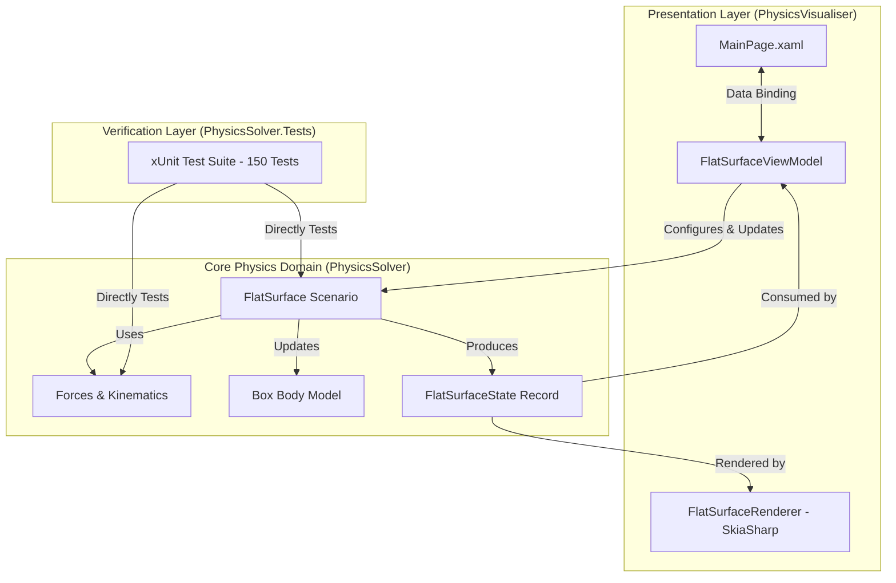
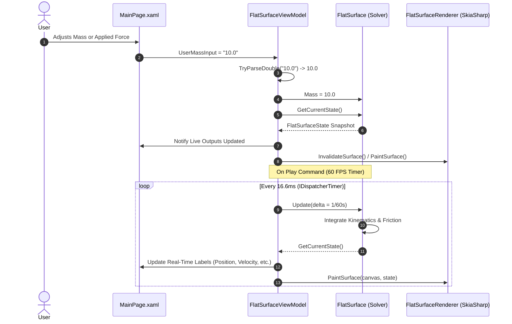

# Architecture: System Design & Data Flow

`PhysicsVisualiser` is structured around a strict **three-tier decoupled architecture**, ensuring that physical domain logic remains completely isolated from the user interface and graphics frameworks.

---

## 1. System Layers

---

## 2. Layer Responsibilities

### 2.1 Domain Layer: `PhysicsSolver`
- **Zero UI Dependencies**: Written in standard, platform-agnostic .NET 10.
- **Deterministic**: Contains no asynchronous scheduling, random number generation, or UI thread synchronization.
- **Pure Functions**: Formulas for forces, acceleration, and kinematic motion exist as pure static methods in `Forces.cs` and `Kinematics.cs`.
- **Immutable State Snapshots**: Simulation state is modeled using C# immutable records (`ScenarioState`, `FlatSurfaceState`).

### 2.2 Presentation Layer: `PhysicsVisualiser`
- **MVVM Pattern**: Built with `CommunityToolkit.Mvvm`, utilizing source-generated `[ObservableProperty]` and `[RelayCommand]` attributes.
- **Input Anti-Jitter**: Decouples active text typing from numerical properties to prevent formatting feedback loops and backspacing cursor jumps.
- **SkiaSharp Rendering**: Encapsulates 2D graphics in standalone renderer classes (`FlatSurfaceRenderer`) that accept read-only state records and an `SKCanvas`.

### 2.3 Verification Layer: `PhysicsSolver.Tests`
- Contains 150 automated unit tests verifying:
  - Theoretical stopping distances and times under friction.
  - Newton's second law ($F = ma$) under multi-force angles.
  - Normal force transitions, friction threshold clamping, and liftoff conditions.

---

## 3. Data Flow & Lifecycle

---

## 4. Concurrency & State Safety

- **Single-Threaded UI Loop**: Simulation ticks are scheduled on the MAUI `IDispatcherTimer`, executing on the main application thread. This eliminates multi-threading locking overhead and prevents race conditions between solver calculations and canvas drawing.
- **Record Immutability**: Because `FlatSurfaceState` is an immutable record, snapshots can be passed to renderers, loggers, or exported without fear of data corruption or mid-frame mutation.
