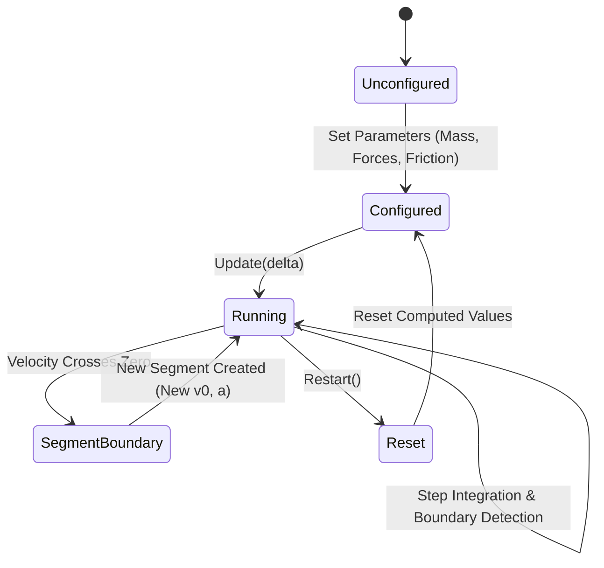

# Scenario Architecture & Implementation Guide

The `PhysicsSolver` engine is architected around the **Scenario Pattern**. A scenario encapsulates a complete physical experiment—its geometry, physical bodies, governing Newtonian differential equations, friction regime transitions, piecewise motion segmentation, and immutable state publication.

---

## 1. Core Abstractions

All physics experiments derive from two foundational types located in [`PhysicsSolver/Scenarios/Scenario.cs`](PhysicsSolver/Scenarios/Scenario.cs):

```csharp
namespace PhysicsSolver.Scenarios;

/// <summary>
/// Base record for all immutable state snapshots emitted by physical scenarios.
/// </summary>
public abstract record ScenarioState();

/// <summary>
/// Abstract contract governing physical simulation stepping.
/// </summary>
public abstract class Scenario
{
    public abstract void Update(double delta);
}
```

### Design Principles
1. **Decoupled Stepping**: The simulation updates via a discrete time delta ($\Delta t$, typically $\frac{1}{60}\text{ s}$), remaining completely agnostic to UI render frames, wall-clock timing jitter, and rendering technology.
2. **Immutable State Snapshots**: Every scenario produces read-only snapshot records inheriting from `ScenarioState`. The simulation internal state is never exposed as mutable references.
3. **Encapsulated Body Mechanics**: Physical objects (such as `Box`, `Surface`, or `Pulley`) are managed internally using domain objects from [`PhysicsSolver.Bodies`](PhysicsSolver/Bodies).

---

## 2. The Scenario Lifecycle



### 1. Configuration Phase
Parameters are injected through strongly-typed public properties with built-in physical validation guards:
```csharp
var scenario = new FlatSurface
{
    Mass = 10.0,                        // Must be > 0
    InitialVelocity = 5.0,
    AppliedForce = 35.0,
    AppliedForceAngle = 20.0,           // Converted into X and Y vector components
    StaticFrictionCoefficient = 0.40,  // Enforces μs >= μk
    KineticFrictionCoefficient = 0.25, // Enforces μk <= μs
    Gravity = 9.80665
};
```

### 2. Initialization & Reset (`Restart()`)
When parameters change or the user restarts the run:
- Total elapsed time and segment timers reset to zero: $t = 0$.
- Positional offsets reset: $x = 0$.
- Velocity reinitializes to the configured initial velocity.
- The `Segments` collection is cleared.
- Forces are re-resolved against the initial boundary state.

### 3. Stepping Loop (`Update(double delta)`)
During each simulation tick:
1. **Time Accumulation**: Increments both `_segmentElapsedTime` and `_totalElapsedTime` by $\Delta t$.
2. **Normal & Weight Resolution**: Calculates $W_y = -m \cdot g$ and $F_{N, y} = \max(0, m \cdot g - F_{\text{applied}, y})$.
3. **Liftoff Detection**: If $F_{\text{applied}, y} \ge m \cdot g$, the body lifts off the surface ($F_N = 0$, friction vanishes).
4. **Friction Regime Evaluation**:
   - **Static Regime ($v = 0$)**: If applied force $|F_{\text{applied}, x}| \le f_{s,\max} = \mu_s F_N$, friction matches applied force identically ($f_s = -F_{\text{applied}, x}$) and net horizontal force $F_{\text{net}, x} = 0$.
   - **Kinetic Regime ($v \ne 0$)**: Kinetic friction opposes velocity: $f_k = -\text{sgn}(v) \cdot \mu_k F_N$.
5. **Kinematic Integration**:
   - Acceleration: $a = \frac{F_{\text{net}, x}}{m}$.
   - Position: $x(t) = x_0 + v_0 t + \frac{1}{2} a t^2$.
   - Velocity: $v(t) = v_0 + a t$.
6. **Zero-Crossing & Segmentation**: If kinetic friction decelerates the body to a halt ($v(t)$ crosses zero within $\Delta t$), the exact stopping timestamp is resolved analytically:
   $$t_{\text{stop}} = -\frac{v_0}{a}$$
   The exact stop position is recorded, a `FlatSurfaceSegment` is appended to `Segments`, and the scenario transitions to static equilibrium.

### 4. State Capture (`GetCurrentState()`)
Publishes an immutable snapshot consumed by view models and renderers:
```csharp
FlatSurfaceState state = scenario.GetCurrentState();
```

---

## 3. Case Study: `FlatSurface` Scenario

[`FlatSurface.cs`](PhysicsSolver/Scenarios/FlatSurface.cs) models a box on a horizontal planar surface subject to angled applied forces, gravity, normal reaction, and non-linear friction transitions.

### Domain Records

```csharp
public record FlatSurfaceSegment(
    double ElapsedTime,
    double StartPosition,
    double InitialVelocity,
    double FinalVelocity,
    double Acceleration
);

public record FlatSurfaceState(
    double Time,
    double Mass,
    double Position,
    double Velocity,
    double Acceleration,
    double Normal,
    double Weight,
    double StaticFrictionCoefficient,
    double KineticFrictionCoefficient,
    double MaxStaticFriction,
    double StaticFriction,
    double KineticFriction,
    double AppliedForceX,
    double AppliedForceY,
    double FNetX,
    double FNetY,
    bool LiftOffWarning
) : ScenarioState();
```

### Segment Tracking
Because acceleration can change discontinuously (e.g., when a sliding block comes to a dead stop and static friction takes over), the scenario partitions motion into discrete **Segments**:
- Each segment stores constant acceleration kinematics over its duration.
- Total displacement is the sum of completed segment displacements plus current active segment displacement.
- Eliminates numerical drift inherent to simple Euler integration.

---

## 4. Guide: Implementing a New Scenario

Follow this 5-step blueprint to add a new physical scenario (e.g., `InclinedPlane`):

### Step 1: Analytical Formulas
If new equations of motion are needed, implement pure static functions in [`PhysicsSolver/Formulas/`](PhysicsSolver/Formulas):

```csharp
namespace PhysicsSolver.Formulas;

public static class InclineFormulas
{
    public static double ParallelGravity(double mass, double gravity, double angleRad) 
        => mass * gravity * Math.Sin(angleRad);

    public static double PerpendicularGravity(double mass, double gravity, double angleRad) 
        => mass * gravity * Math.Cos(angleRad);
}
```

### Step 2: Scenario & State Implementation
Create `InclinedPlane.cs` inheriting from `Scenario`:

```csharp
namespace PhysicsSolver.Scenarios;

public record InclinedPlaneState(
    double Time,
    double PositionAlongIncline,
    double Velocity,
    double Acceleration,
    double NormalForce,
    double InclineAngleDeg
) : ScenarioState();

public class InclinedPlane : Scenario
{
    public double InclineAngle { get; set; } = 30.0;
    public double Mass { get; set; } = 5.0;
    public double Gravity { get; set; } = 9.80665;
    
    public override void Update(double delta)
    {
        // 1. Resolve components along and perpendicular to plane
        // 2. Compute Normal force: F_N = m * g * cos(theta)
        // 3. Resolve friction and net acceleration
        // 4. Update kinematics
    }

    public InclinedPlaneState GetCurrentState() => ...;
}
```

### Step 3: Unit Testing
Add comprehensive unit tests in [`PhysicsSolver.Tests`](PhysicsSolver.Tests):
- Validate terminal velocity and equilibrium conditions.
- Test edge cases: vertical planes ($\theta = 90^\circ$), horizontal planes ($\theta = 0^\circ$), zero friction.
- Assert exact mathematical convergence against analytical solutions.

### Step 4: Visualiser Renderer
Create a dedicated SkiaSharp renderer implementing `IScenarioRenderer` in [`PhysicsVisualiser/Rendering/`](PhysicsVisualiser/Renderers):
- Render the rotated surface wedge/ramp.
- Render the sliding block oriented to the incline angle.
- Project force vectors parallel and perpendicular to the incline surface.

### Step 5: ViewModel & UI Controls
1. Create `InclinedPlaneViewModel.cs` exposing input properties for parameters and output properties for state.
2. Build or bind UI controls in XAML with responsive layout containers.

---

## 5. Scenario Roadmap

- **Flat Surface** (Implemented)
- **Inclined Plane**
- **One body on surface, another hanging from table side, connected by a string**
- **Pulley System**
- **Projectile Motion**
